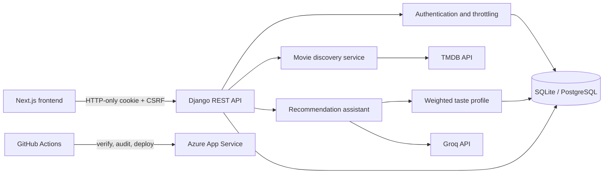

# CineMind API

<p align="center">
  <strong>A secure, personalized movie-discovery API built with Django REST Framework.</strong>
</p>

<p align="center">
  <a href="https://github.com/Mohcen56/Cinemind-Backend/actions/workflows/main_cinemind-backend.yml">
    
  </a>
  
  
  
  
</p>

<p align="center">
  <a href="https://github.com/Mohcen56/Cinemind-frontend">Frontend repository</a>
  ·
  <a href="#quick-start">Quick start</a>
  ·
  <a href="#api-reference">API reference</a>
  ·
  <a href="DEPLOYMENT.md">Deployment guide</a>
</p>

CineMind helps people discover movies, maintain a watchlist, rate what they have seen, and receive conversational recommendations shaped by their own activity. The API combines live [TMDB](https://www.themoviedb.org/) data with a weighted taste profile and Groq-hosted language models.

This is not a thin AI wrapper. The backend owns authentication, CSRF enforcement, user-level data isolation, external-service failure handling, recommendation context, rate limiting, persistence, tests, and CI/CD.

## Engineering highlights

- **Secure browser authentication** — token authentication is stored in an HTTP-only cookie, while every unsafe cookie-authenticated request is protected by Django CSRF validation. API clients may alternatively use an explicit `Authorization` header.
- **Strict account isolation** — ratings and saved movies are always queried through the authenticated user, preventing one account from reading another account's activity.
- **Personalized recommendations** — persisted interactions are converted into weighted `LOVES`, `LIKES`, `WATCHLIST`, and `HATES` signals before the assistant creates recommendations.
- **Resilient integrations** — TMDB requests use explicit timeouts and meaningful gateway responses; Groq requests retry through a second production model when the primary model fails.
- **Durable metadata** — movie titles and poster paths are stored with interactions, reducing repeated TMDB lookups and keeping preference generation useful when an upstream request is unavailable.
- **Abuse protection** — dedicated throttles protect login, registration, profile, password, and chat endpoints.
- **Deployment gates** — GitHub Actions runs linting, format validation, Django deployment checks, migration checks, tests, and dependency auditing before deploying a curated artifact to Azure.

## Architecture



### Recommendation flow

1. CineMind reads only the authenticated user's saved movies and ratings.
2. Interactions become positive, negative, and watchlist preference signals.
3. Recent conversation context and relevant TMDB results are added to the prompt.
4. Groq returns structured recommendations using the primary model or the configured fallback.
5. Titles are validated against TMDB so the client receives real movie IDs, posters, and metadata.

The current implementation deliberately does **not** claim to be retrieval-augmented generation (RAG): it uses structured application data and live API context, not embeddings or a vector database.

## Technology

| Area | Tools |
| --- | --- |
| API | Python, Django, Django REST Framework |
| Authentication | DRF token authentication, HTTP-only cookies, Django CSRF |
| Data | SQLite for development, PostgreSQL/Neon in production |
| Movie data | TMDB API |
| AI | Groq OpenAI-compatible API, primary/fallback models |
| Production | Gunicorn, WhiteNoise, Azure App Service |
| Quality | Django test suite, Ruff, pip-audit |
| Delivery | GitHub Actions and Azure federated identity |

## Quick start

### Requirements

- Python 3.11 or newer
- A [TMDB API read access token](https://developer.themoviedb.org/docs/getting-started)
- A [Groq API key](https://console.groq.com/keys) for assistant features

### Windows PowerShell

```powershell
git clone https://github.com/Mohcen56/Cinemind-Backend.git
cd Cinemind-Backend

py -3.11 -m venv .venv
.\.venv\Scripts\Activate.ps1
python -m pip install --upgrade pip
pip install -r requirements-dev.txt

Copy-Item .env.example .env
python manage.py migrate
python manage.py runserver
```

### macOS or Linux

```bash
git clone https://github.com/Mohcen56/Cinemind-Backend.git
cd Cinemind-Backend

python3 -m venv .venv
source .venv/bin/activate
python -m pip install --upgrade pip
pip install -r requirements-dev.txt

cp .env.example .env
python manage.py migrate
python manage.py runserver
```

Open `.env` and replace the placeholder values before starting the server:

```env
SECRET_KEY=generate-a-unique-random-secret
TMDB_API_KEY=your-tmdb-read-access-token
GROQ_API_KEY=your-groq-api-key
```

Generate a Django secret without inventing one manually:

```bash
python -c "from django.core.management.utils import get_random_secret_key; print(get_random_secret_key())"
```

The API starts at `http://127.0.0.1:8000`. SQLite is used automatically when `DATABASE_URL` is blank.

> [!IMPORTANT]
> `.env` contains private credentials and is ignored by Git. Never commit it. `.env.example` contains names and safe placeholders so another developer knows how to configure the project.

## Environment variables

| Variable | Purpose | Local default |
| --- | --- | --- |
| `SECRET_KEY` | Django cryptographic signing key | Required |
| `TMDB_API_KEY` | TMDB bearer token | Required |
| `GROQ_API_KEY` | Groq project key | Empty; chat requires it |
| `GROQ_MODEL` | Primary assistant model | `openai/gpt-oss-20b` |
| `GROQ_FALLBACK_MODEL` | Retry model | `openai/gpt-oss-120b` |
| `DATABASE_URL` | PostgreSQL connection URL | Empty; uses SQLite |
| `ALLOWED_HOSTS` | Comma-separated Django hosts | Localhost values |
| `CORS_ALLOWED_ORIGINS` | Browser origins allowed to call the API | Next.js localhost |
| `CSRF_TRUSTED_ORIGINS` | Trusted origins for unsafe requests | Next.js localhost |
| `AUTH_COOKIE_SECURE` | Restrict auth cookie to HTTPS | `False` locally |
| `SECURE_SSL_REDIRECT` | Redirect HTTP to HTTPS | `False` locally |

See [`.env.example`](.env.example) for the complete local-development configuration. Production should use HTTPS-only cookies, `DEBUG=False`, HSTS, a PostgreSQL `DATABASE_URL`, and deployment-platform secrets.

## API reference

### Movie discovery

| Method | Endpoint | Authentication | Description |
| --- | --- | --- | --- |
| `GET` | `/api/movies/?q={query}&page={page}` | Public | Search movies or browse popular titles |
| `GET` | `/api/movies/{movie_id}/` | Public | Fetch details, credits, trailers, providers, and related movies |
| `GET` | `/api/movies/trending/` | Public | Fetch TMDB's weekly trending movies |
| `POST` | `/api/search/update/` | Public | Record a selected search result |
| `GET` | `/api/search/trending/` | Public | Return the ten most selected searches |

### Authentication and profiles

| Method | Endpoint | Authentication | Description |
| --- | --- | --- | --- |
| `GET` | `/api/auth/csrf/` | Public | Issue the CSRF cookie and masked token |
| `POST` | `/api/auth/register/` | CSRF | Create an account and authentication cookie |
| `POST` | `/api/auth/login/` | CSRF | Authenticate by email and set the cookie |
| `POST` | `/api/auth/logout/` | Required | Revoke the token and clear the cookie |
| `GET` | `/api/auth/profile/` | Required | Return the current user |
| `PATCH` | `/api/auth/profile/update/` | Required | Update profile fields |
| `PATCH` | `/api/auth/profile/avatar/` | Required | Upload a profile image |
| `POST` | `/api/auth/change-password/` | Required | Verify the old password and rotate credentials |

### Personalization and assistant

| Method | Endpoint | Authentication | Description |
| --- | --- | --- | --- |
| `POST` | `/api/auth/movies/{movie_id}/rate/` | Required | Set a rating from 0 to 5 in half-star steps |
| `POST` | `/api/auth/movies/{movie_id}/save/` | Required | Toggle the movie in the user's watchlist |
| `GET` | `/api/auth/movies/{movie_id}/interaction/` | Required | Return the current user's rating/save state |
| `GET` | `/api/auth/movies/saved/` | Required | Return the current user's saved movies |
| `POST` | `/api/chat/` | Required | Generate contextual movie recommendations |

Browser clients should request `/api/auth/csrf/` first, send cookies with credentials enabled, and include the returned value in the `X-CSRFToken` header for unsafe methods.

## Quality and testing

External TMDB and Groq calls are mocked in the automated suite. The tests cover:

- CSRF rejection and acceptance paths
- Secure cookie creation and token revocation
- Header-based API authentication
- Password-change payload compatibility
- Cross-account movie-interaction isolation
- Saved/rated metadata persistence
- TMDB timeouts and upstream failures
- Chat authentication, throttling, fallback, and malformed model responses
- Weighted preference-profile generation and caching

Run the same quality gates used by CI:

```bash
ruff check .
ruff format --check .
python manage.py check
python manage.py check --deploy
python manage.py makemigrations --check --dry-run
python manage.py test
pip-audit -r requirements.txt
```

## CI/CD

Every pull request runs the verification job. A push to `main` deploys only after all checks pass:

```text
Install → Lint → Format check → Django checks → Migration check
        → Tests → Dependency audit → Build artifact → Azure deployment
```

The deployment job uses Azure federated identity and uploads only runtime files instead of packaging the complete repository. See [DEPLOYMENT.md](DEPLOYMENT.md) for environment and infrastructure setup.

## Repository guide

The similarly named files are intentional:

| File | Why it exists |
| --- | --- |
| `.env` | Your private, machine-specific values. Ignored by Git. |
| `.env.example` | Safe configuration template committed for developers and CI documentation. |
| `requirements.txt` | Packages required to run the API in production. |
| `requirements-dev.txt` | Includes production packages plus Ruff and pip-audit for development/CI. |
| `pyproject.toml` | Ruff's linting and formatting configuration. |
| `Procfile` | Process declaration understood by platforms that support the Procfile convention. |
| `startup.sh` | Azure/Linux startup sequence: install, collect static files, migrate, and start Gunicorn. |
| `DEPLOYMENT.md` | Infrastructure and production configuration instructions. |
| `.github/workflows/main_cinemind-backend.yml` | Automated verification and Azure deployment pipeline. |

Separating runtime dependencies from development tools keeps production deployments smaller and reduces the production attack surface. Separating `.env` from `.env.example` prevents secrets from entering source control while keeping setup reproducible.

## Project structure

```text
Backend/
├── config/                  # Django settings, root URLs, ASGI and WSGI
├── core/                    # Discovery, trending, assistant, TMDB and AI services
├── user/                    # Accounts, secure auth, profiles and movie interactions
├── .github/workflows/       # CI/CD pipeline
├── .env.example             # Safe environment template
├── manage.py
├── requirements.txt         # Runtime dependencies
├── requirements-dev.txt     # Development and CI dependencies
├── Procfile
└── startup.sh
```

## Design trade-offs and next steps

- Token cookies keep credentials away from browser JavaScript, but require deliberate CSRF handling; this API enforces both parts of that model.
- The weighted taste profile is explainable and inexpensive, while embeddings could become useful later for semantic similarity at a larger catalog scale.
- SQLite makes onboarding immediate; `DATABASE_URL` switches production to PostgreSQL without changing application code.
- The next engineering milestones are generated OpenAPI documentation, structured production logging, Redis-backed throttling/cache, and end-to-end browser tests.

## Author

Built by [Mohcen](https://github.com/Mohcen56) as a full-stack portfolio project focused on secure API design, external-service resilience, personalization, and automated delivery.
